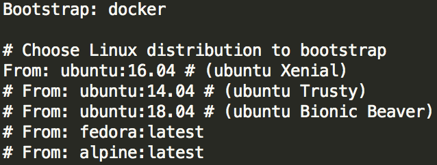

Use: internal,external

# Bootstrapping your recipe file with a template
In the event that your needs are not met through an existing Singularity container on Quest, Singularity Hub, or via a Docker image, you'll need to create a new Singularity container with a Singularity recipe file. You can read more about the structure and components of a recipe file in our post or on [Singularity's documentation on the subject](http://singularity.lbl.gov/docs-recipes).

When it comes to writing this recipe, you need not start from scratch. We have written Singularity template files to use as starting points for users to build containers with a particular purpose. Edit them to your liking, build them into containers with `sudp singularity build`, and upload them to Quest to get up and running with a container best suited for your needs.

The template recipe files are located in the [NU Research Computing Services Singularity repository](https://github.com/ffineis/nurcs-singularity) in the `templates` directory.

Since `#` symbols are used for comments in Singularity recipe files, simply un-comment lines to have them execute while building a container.

#### Creating + testing containers: best practices
Once you have made edits to a template recipe file, you'll build the container on a machine where you have `sudo` access. It is recommended that you first create a [*writable* container](https://singularity.lbl.gov/docs-build-container#--writable), enter into the container with `singularity shell`, and test that the container works as intended. Once verified, create a "production" container by creating a duplicate, but "un-writable" container:

```bash
$ sudo singularity build [container name] [writable container name]
```


## Bootstrapping a Linux container

(See `/templates/linux.recipe`)

#### Choosing a Linux distribution
First, choose the Linux distribution. The default is Linux Ubuntu 16.04 (Xenial release), and the rest of the template is designed for an Ubuntu container. It is important to note that the `apt-get` package installer tool is the package management command for Linux Ubuntu distributions. Other distributions - for example Alpine Linux or Fedora - may use other package management commands (e.g. `yum` or `apk`).



The distribution image will be bootstrapped from Docker Hub (note line 1) - bootstrapping from Docker is the easiest way to get a container up and running.

#### The `%post` section
The `%post` section is dedicated to installing useful command line utilities such as `git` and `wget`, and important Linux packages that are often required by software you will try to install later on. The first step towards installing any packages or command line utilities is to run

```bash
$ apt-get -y update && apt-get -y upgrade
```

Should you need more libraries or access to more command line utilities, just append them to the `apt-get install` command. Recall that you can join lines with a forward-slash (`\`). Breaking up the list of Linux packages you're trying to install with `\`'s will make your recipe more readable and easier to scan when trying to install packages that are all similarly-named...


The the last commands in the `%post` section are for mounting directories you might want access to later on in Quest, and then finally, for installing whatever other software you may want (for example, Miniconda 3). Since you will build your container with `sudo singularity build...`, you have administrator-like access while running any commands in the `%post` section during build.

Note that you can ensure that variables are exported (e.g. `$PATH`) upon launching a container with the `$SINGULARITY_ENVIRONMENT` variable. For example, in `linux.recipe`, we could export `$PATH` to include Anaconda command line utilities.


## Bootstrapping a GPU-enabled container
There are three major steps in building a GPU-enabled container:
1. Install the correct CUDA release compatible with the NVIDIA drivers on the Quest GPU partitions available to you. Only specific versions of NVIDIA drivers are compatible with specific CUDA versions. It is recommended that you [pull a Docker image from NVIDIA](https://hub.docker.com/r/nvidia/cuda/) with the CUDA version you want installed on it.
2. Add the CUDA executable + library files to your `$PATH`. Most often, these 
3. Install your GPU-enabled software, e.g. Tensorflow.

A great starting point for building GPU-enabled containers is a [recipe file from the University of Utah](https://github.com/CHPC-UofU/Singularity-ubuntu-gpu/blob/master/Singularity) that pulls an NVIDIA Docker image with CUDA installed and sets up the `$PATH` variable for you.

If you are curious about the NVIDIA drivers on your GPU partition, run the command `nvidia-smi`. Note that not all CUDA releases are compatible with all NVIDIA driver versions - you must match them here.


| CUDA version | NVIDIA driver version |
|--------------|-----------------------|
|CUDA 9.2:     |        396.xx         |
|CUDA 9.1:     | 387.xx                |
|CUDA 9.0:     | 384.xx                |
|CUDA 8.0      | 375.xx (GA2)          |
|CUDA 8.0:     | 367.4x                |
|CUDA 7.5:     | 352.xx                |
|CUDA 7.0:     | 346.xx                |
|CUDA 6.5:     | 340.xx                |
|CUDA 6.0:     | 331.xx                |
|CUDA 5.5:     | 319.xx                |
|CUDA 5.0:     | 304.xx                |
|CUDA 4.2:     | 295.41                |
|CUDA 4.1:     | 285.05.33             |
|CUDA 4.0:     | 270.41.19             |
|CUDA 3.2:     | 260.19.26             |
|CUDA 3.1:     | 256.40                |
|CUDA 3.0:     | 195.36.15             |


## Bootstrapping a bioBakery container
[bioBakery](https://bitbucket.org/biobakery/biobakery/wiki/Home) is a suite of software tools used by the genomics and microbial research community. There are currently 20+ constituent bioBakery tools. Typically, users install all of these tools with *Homebrew*, an open-source package management system for the Mac OS. There is a Linux version of Homebrew called *Linuxbrew*, so, in theory users should be able to `brew install` bioBakery tools from Linux-OS Singularity containers using Linuxbrew.

Despite the appearance of simplicity, installing bioBakery tools via Linuxbrew often fails for a multitude of reasons. Further complicating bioBakery tool installation using Linuxbrew is the fact that `*brew` is not supposed to be run as root; execept in Singularity, users *must* build containers as root. So, the work around becomes creating an auxiliary user (call her "brewuser") and running `brew install` commands as brewuser with `su -c`. [Here](https://github.com/CHPC-UofU/Singularity-bioBakery/blob/master/Singularity) is an example of someone once successfully hacking Linuxbrew with Singularity to install the bioBakery suite. It is now deprecated (for example, various brew taps have been renamed/reorganized).

Instead, we recommend starting with a bioBakery Docker container, for example:

```bash
Bootstrap: docker
From: biobakery/biobakery
```

and then manually installing additional bioBakery tools (as opposed to Linux`brew install`-ing these tools) as needed. Here is a link to [all available bioBakery Docker containers](https://hub.docker.com/u/biobakery/).

You will find one composite container ([`biobakery/biobakery`](https://hub.docker.com/r/biobakery/biobakery/)) with 16 tools installed:
- humann2
- shortbred
- graphlan
- kneaddata
- ppanini
- maaslin
- strainphlan
- micropita
- sparsedossa
- picrust
- breadcrumbs
- halla
- hclust2
- panphlan
- lefse
- workflows

Alternatively, the remaining Docker containers each have an individual bioBakery tool installed. Should you need a multitude of tools, our [bioBakery Container](https://github.com/ffineis/nurcs-singularity/blob/master/singularity_files/biobakery/Singularity.biobakery) (available on Singularity Hub) offers an example of bootstrapping the `biobakery/biobakery` container from Docker and then manually installing the `metaphlan` tool:


# FAQ
1. Why can't I access my data within a Singularity container?
    - Make sure that the directory where your data lives is bound to the container. Either put the data somewhere rooted in your `$HOME` directory, or bind the directory where your data lives when calling `singularity run/shell/exec` with the `-B` flag. Read the [Singularity documentation on binding/mounting directories](http://singularity.lbl.gov/docs-mount) to make them visible to your containers, or read the `Singularity on Quest` documentation for further assistance.
2. `sudo: command not found` Error
    - You will never need the `sudo` command within a Singularity recipe file. Because you can only ever run `singularity build` by prefacing it with `sudo`, the sudo privileges get passed to `root`, the user actually executing the commands in the `%post` section during container build.
3. Are environment modules available from within a Singularity container?
    - Unfortunately, no. You will not be able to run `module load <module name>` from within a container; you will need to install that software you had intended to load into the container itself.
