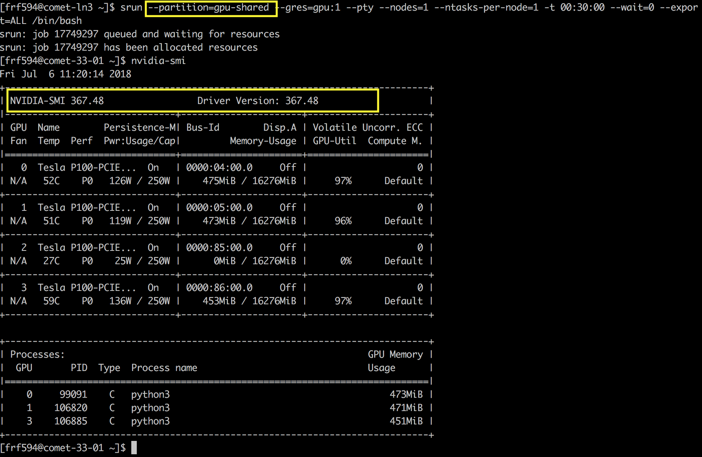
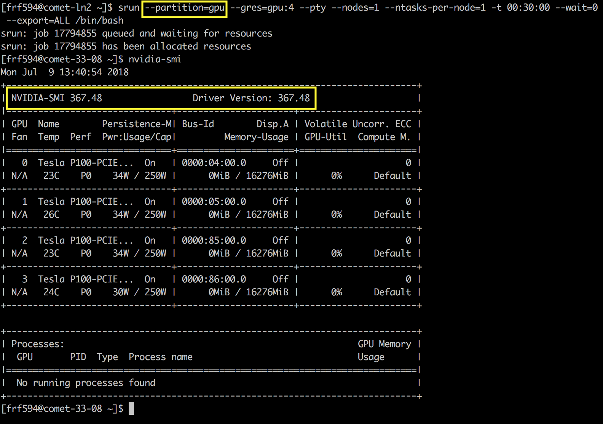
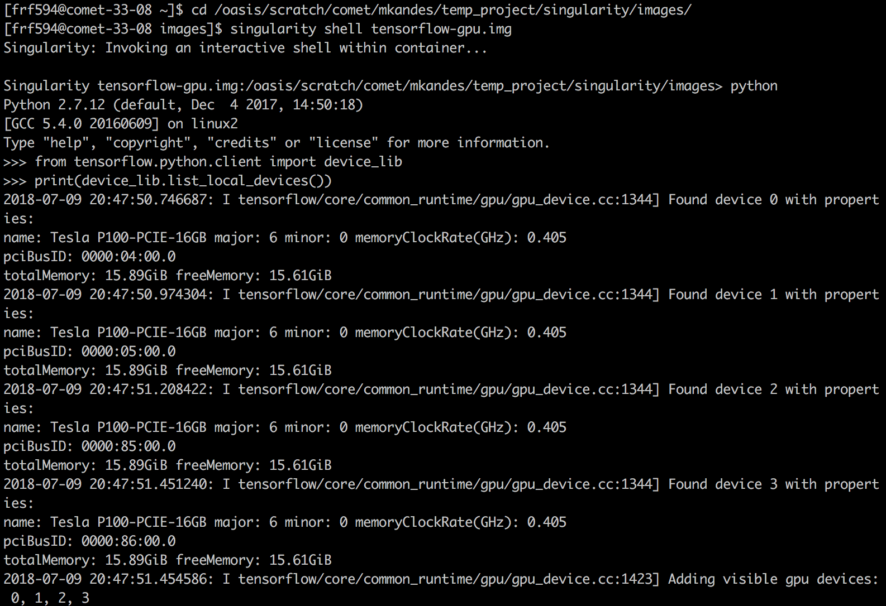

Use: internal

# Singularity and GPUs
One of the most obvious Singularity use cases is for GPU computing. The DevOps-related overhead in creating a GPU-ready computing environment is going to be beyond what a typical user will likely want to endure, and with Singularity we can deploy containers that come with the entire GPU ecosystem pre-configured and ready for use with Tensorflow, Keras, MXNet, etc.

The trickiest part about deploying a GPU-enabled Singularity container is that the CUDA library files and NVIDIA drivers must be installed or mounted within the container, and they must match the versions on Quest.

## GPU's with Singularity
Singularity's main author, Greg Kurtzer, has made using Singularity with GPU's as simple as 

```bash
$ singularity run container.simg [script] --nv
```

where `--nv` is short for NVIDIA. This flag tells singularity to search for the NVIDIA drivers on the host, so that the host's driver files can be bound to the container.


## CUDA requirements
Specific Tensorflow (and therefore Keras) releases are only compatible with specific CUDA releases. For example, [Tensorflow 1.7 ceased to support CUDA versions earlier than 8.0 and cuDNN versions earlier than 6.0](https://github.com/tensorflow/tensorflow/releases), CUDA 9.0 can't be used with Tensorflow 1.4, etc. It's [possible](http://www.python36.com/how-to-install-tensorflow-gpu-with-cuda-9-2-for-python-on-ubuntu/) to install Tensorflow 1.8 with CUDA 9.2 as well as CUDA 8.0 (the latter is what the USCD Supercomputer Center has deployed on their XSDED cluster - [GH recipe file](https://github.com/mkandes/naked-singularity/blob/master/definition-files/us/ucsd/sdsc/comet/tensorflow/tensorflow-gpu.def)).

Within the container, the easiest way to install CUDA (rather than mount) is to just Bootstrap an [NVIDIA CUDA Docker image](https://hub.docker.com/r/nvidia/cuda/) for the version matching a CUDA installation available on Quest via an Environment Module (e.g. 8.0 or 9.2). The CUDA and corresponding library/shared object files have to be added to the $PATH and $LD_LIBRARY_PATH. 

Alternatively (and probably more simply), we could just hard-code the CUDA paths on Quest (i.e. `/software/cuda/...`) and build those. This hurts portability, because I can't use this on my machine unless I have the same path locally, or if I bind my own CUDA install to the CUDA paths named in the recipe file at singularity runtime using the `-B` flag.

Another (probably worse) option is to require that the user has run `load module cuda/[version]` and then hardcode the path to the CUDA library/shared object files within a recipe file, build that container, and then pray that the user chooses the correct container on Quest. This would hurt portability more than simply relying on a particular CUDA version.

## NVIDIA requirements

#### Within the container
NVIDIA drivers must be either installed or mounted on the Singularity container. As [this](http://gpucomputing.shef.ac.uk/education/creating_gpu_singularity/) **extremely useful** document from the University of Sheffield discusses (and remedies), it's a bad idea to install the driver files directly within the container because drivers vary so much between GPU setups, so we'd wreck portability by installing one set of drivers. We'd write one container recipe file for each unique GPU configuration the Quest resource pool. The solution is to download the drivers depending on the NVIDIA drivers on the host, extract them into a directory and mount that directory into a fixed location within the container. The [document mentioned previously](http://gpucomputing.shef.ac.uk/education/creating_gpu_singularity/) outlines exactly how to do that.

Their strategy is more easily maintanable for RCS - it results in one recipe file (one file for each CUDA release) and one shell file that can download and unpack the NVIDIA driver files that match the drivers installed on Quest.

#### On Quest
We need `nvidia-smi` (the NVIDIA System Management Interface) installed on Quest. I don't believe there are any Environment Modules that load `nvidia-smi`; this probably has something to do with the partitioning of Quest's GPU resources away from the standard log-in/compute nodes users log into.


## GPU workflow at SDSC
The San Diego Supercomputer Center's "Comet" HPC has two GPU partitions named "gpu" and "gpu-shared." Comet users can use a single Tensorflow container with either partition, even though the partitions presumably have different GPU node configurations (e.g. different mix of k80 or p100 nodes).

Note that the `nvidia-smi` CLI isn't available to Comet users until they request the "gpu" or "gpu-shared" partition through Slurm. For example, here's me requesting an interactive session with the gpu-shared partition and inspecting SDSC's GPU set-up:



Further, note that the drivers on the "gpu-shared" partition are the same version on the "gpu" partition:



This is why SDSC can get away with using only the single Tensorflow singularity container located at /oasis/scratch/comet/mkandes/temp_project/singularity/images/. Users are supposed to use GPU-enabled containers in that directory via `singularity shell` (for an interactive session) or `singularity exec`. For example, below is a screenshot of how we could run an interactive Tensorflow session using way too many GPUs:




