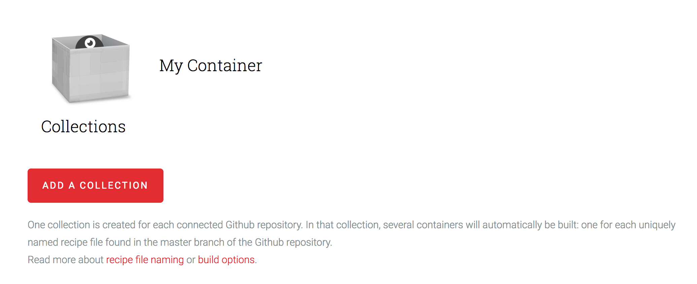
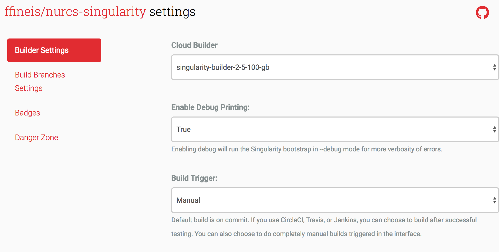
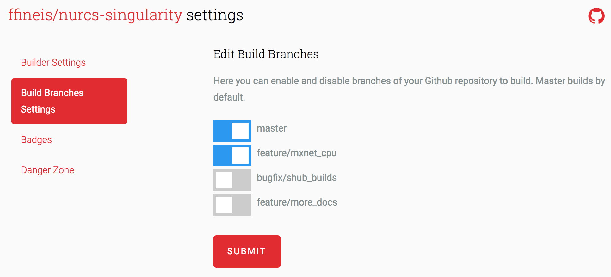
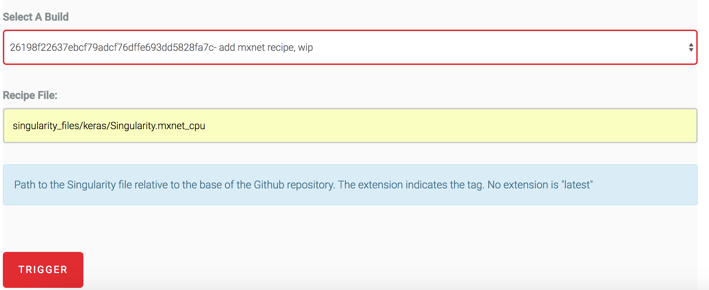

Use: internal

# Continuous Integration and Singularity-Hub

[Singularity-Hub](https://www.singularity-hub.org/) offers a solution for continuous integration and automated builds of anyone's Singularity containers. The process is simple, and requires very little configuration or adherence to new conventions.

On Singularity Hub, users host "collections" of containers. Each collection is connected to one Github repository, and one collection can contain many containers. Users will be able to pull the containers using the `singularity` command line interface. What you get with Singularity-Hub integration is the following:

- A test that your recipe files indeed build correctly
- Hosts your singularity recipe files for others to download
- Includes metadata for your containers, e.g. OS specifications, build logs, and the option to add supplementary data to your collection like links to tutorials
- The ability to pull your containers from Singularity-Hub from the command line using `singularity pull shub://[username]/[collection name]:[tag]`


## Configuration

1. Create a Singularity Hub account and authenticate it on Github. 

2. Create a new container collection and connect a Github repository to it. Singularity Hub will scan this repository for files titled "Singularity.[container tag]" anywhere in the repository and begin to attempt to build them, sequentially. NUIT will likely just have one repository. Once you've connected your repository to your collection, your collection will be viewable

<center>

</center>

3. Once you've connected your repository to your collection, your collection will be viewable at https://www.singularity-hub.org/collections/[collection number]. Navigate there.

4. When commits are pushed to master, any recipe files that have been modified will be rebuilt. Best practices should be either to have automatic builds when commits to Singularity recipes are merged into master. An automatic or manual build trigger can be controlled in the "[collection URL]/Settings" or "Builder Settings" tab.

<center>

</center>

Alternatively, individual containers can be built manually from any branch. Just add the branch to the "[collection URL]/Settings" "Build Branches" tab:

<center>

</center>

and then navigate to "Trigger Build" page to select a commit and a specific Singularity recipe to build.

<center>

</center>

**Note:** for manual builds, you have to abide by the Github repository's file structure when specifying the recipe file you are attempting to build - the [Singularity Builders](https://github.com/singularityhub/singularityhub.github.io/wiki/Meet-Builders) will not just find it (unlike during the automated build process). You must specify the entire Singularity recipe file's path relative to the repository's root.

Your builds will either be `running` (building), `waiting` for another container to finish building (containers are built in a sequence), or `complete` (ready to be pulled).


## Pulling images built on Singularity Hub
There are several options for users to get a hold of a container. If we decide to continue with builds hosted on Singularity Hub, users can pull the container and store it in their home directory. For example, they can pull the Keras-CPU container like this:

```bash
$ singularity pull --name keras_cpu.simg shub://ffineis/nurcs-singularity:keras_cpu.simg
```

Note that just `singularity pull`'ing a container will cause the container to be pulled with a *gross* file name: "[repo name]-[branch name used from build]-[container name]." Users should be encouraged to use a custom, simple file name for the pulled image by using the `--name` flag.
